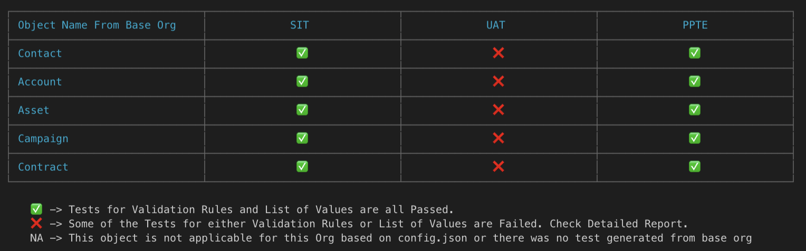
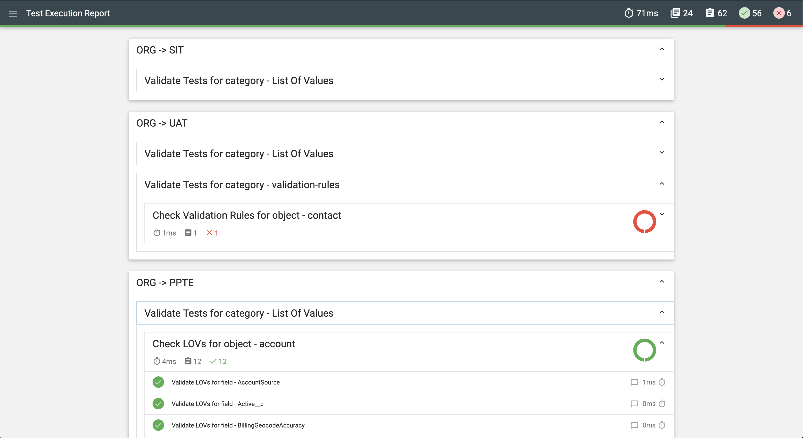

# salesforce-env-tests

This utility will help you to build and run automated tests to validate Salesforce environment configuration for the specified objects for below metadata type

- Validation Rules
- List of Values

## What do you need to do?

To start with utility you would have to setup the **config.json** file. Open `config.json` and setup below configuration.

### Setup Config File

- `"baseOrg"` : This should be the salesforce environment which would act as Base and the automated tests will be generated based on its metadata. You can specify any alias name for this. e.g: "QA" <br /> <br />
  **As it is a base org, only one value is allowed to assigned to this key**

* `"destinationOrgs"` : This is the target Salesforce environment against which the tests has to run. There can be one or more destination environment/orgs referenced. <br/> <br/>
  **Please note this must be defined as an array, even if you want to specify only one destination org**

Example config:

```json
   "baseOrg": "QA",
    "destinationOrgs": [
        "SIT",
        "UAT",
        "PPTE"
    ]
```

- `"objectList"` : This contain list of objects for each environment/org specified in above `baseOrg` and `destinationOrgs`. Based on above config for base and destination orgs, this would look like as:

```json
"objectList": {
        "QA": [
            "contact",
            "account",
            "asset",
            "campaign",
            "contract"
        ],
        "SIT": [
            "account",
            "contract",
            "campaign",
            "asset"
        ],
        "UAT": [
            "contact",
            "account",
            "contract",
            "campaign",
            "asset"
        ],
        "PPTE": [
            "contact",
            "account",
            "contract",
            "campaign",
            "asset"
        ]
    },
```

As these objects are setup at every org level, so can be configured accordingly.

- `"generateBaseTests"` :(Boolean) This is very important key of this utility. This specifies whether or not base tests need to be generated for every validation of destination orgs. <br/> <br/> In an actual environment, you would like to generate base tests from your **QA** environment for the release and continue to validate against destination orgs for the rest of the release and at the same time new changes will get deployed in QA environment. <br/><br/> So this means, this parameter must be set to **`true`** for the first time and `false` thereafter, unless you want to specifically overwrite base tests this key value must always be `false`. <br/> <br/> **With this in mind, code is designed to update it automatically to `false` whenever it generates base tests successfully. So you don't have to manually bother updating it.**

```json
"generateBaseTests": true,
```

- `"autoOpenDetailedExecutionReport"` : (Boolean) This field derives if the detailed execution report should open automatically after successfull test execution completion. This must be set either `true` or `false` based on your preference. <br/><br/>_Please note this report will only be generate on successful test execution, this report will not be generated, if there is an error in setup or connection error due to invalid credentials._

```json
"autoOpenDetailedExecutionReport": false,
```

- `"loginDetails"` : As name suggests, this contains the login credentials for your Salesforce Orgs. <br/> To avoid any setup error, provide credentials for every `base` and `destination` org in below format:

```json
"loginDetails": {
        "QA": {
            "loginURL": "https://login.salesforce.com",
            "username": "sampleUsername",
            "password": "samplePassword",
            "security_token": "sampleSecurityToken",
            "version": 47
        },
        "SIT": {
            "loginURL": "https://login.salesforce.com",
            "username": "sampleUsername",
            "password": "samplePassword",
            "security_token": "sampleSecurityToken",
            "version": 47
        },
        "UAT": {
            "loginURL": "https://login.salesforce.com",
            "username": "sampleUsername",
            "password": "samplePassword",
            "security_token": "sampleSecurityToken",
            "version": 47
        },
         "PPTE": {
            "loginURL": "https://login.salesforce.com",
            "username": "sampleUsername",
            "password": "samplePassword",
            "security_token": "sampleSecurityToken",
            "version": 47
        }
    },
```

_Have a look at this article to understand how to reset your Security Token -
<a href="https://help.salesforce.com/articleView?id=user_security_token.htm&type=5" target="_blank">Reset Your Security Token</a>_

**Please note this user must have access to make API calls to Salesforce org. Preferably, use user with admin rights.**

- `"LOGGING"`: This is configuration to enable console messages. You can enable each level of logging by setting `true` or `false` for it. By default, all logging levels are enabled and config is as below:

```json
"LOGGING": {
        "ERROR": true,
        "SUCCESS": true,
        "WARNING": true,
        "INFO": true
    }
```

### Generate and Execute Automated Tests

#### Clone the repository - [salesforce-env-config-tests](https://github.com/puneetpunj/salesforce-env-config-tests)

```bash
git clone git@github.com:puneetpunj/salesforce-env-config-tests.git

cd salesforce-env-config-tests
```

#### Execute Using Docker

```docker
docker build -t sfconfigtests .

docker run -v "`pwd`/execution-report":/mnt/execution-report -it sfconfigtests
```

#### Execute Locally with node.js

Prerequisite - [node.js](https://nodejs.org) must be installed

```bash
npm i
npm run comparison
```

### Execution Report

#### Terminal Execution Report

Tabular execution report at object level will be generated at the end of execution



First Column of this report table is generated against Object List mentioned in `"objectList"` key for base org. In above example, it would be `objectList.QA`. <br/> <br/>
Next columns are generated per destination Org mentioned in `destinationOrgs` array in _`config.json`_.

#### Detailed Execution Report

A new directory `execution-report` will be generated automatically after successful execution completion. And this would contain `detailed-execution-report.html` with detailed result for every test for `validation-rules` and `lov` for every destination org.<br/> <br/>**Note:** This report would open automatically in your browser if `"autoOpenDetailedExecutionReport"` is set to `true`. If not, go to `execution-report>` folder and open `.html` file manually.


